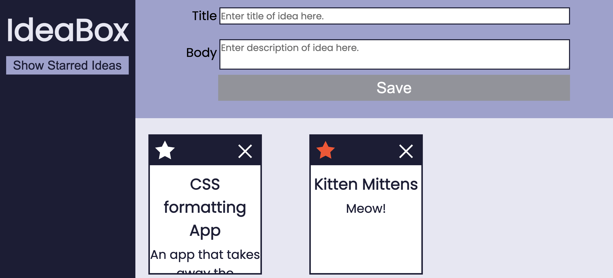

# IdeaBox

### Abstract
Coming up with a great idea is only great when you can remember it. This app solves that problem by allowing users to create and save an inventory of ideas. With this inventory, you can 'favorite' ideas and filter those out from the rest. You can also delete any ideas you no longer want.

### Installation Instructions
To use this app, go to this [GitHub repository](https://github.com/corysanders3/ideaBox) and fork and clone the repository onto your computer. Open the file and start saving your ideas!

### Preview of App

### Context
We worked on this project for ~18 hours. All contributors are in Mod 1.

### Contributors
[Cory Sanders](https://github.com/corysanders3/)
[Tom Coney](https://github.com/tconey23)
[Erin Kelley](https://github.com/kelleyej)
[Megan Crotteau](https://github.com/crotteau)

### Learning Goals
- Gain an understanding of how to write clean HTML and CSS to match a provided comp
- Understand how a developer might separate the data model from the DOM model
- Incorporate & iterate over arrays in order to filter what is being displayed
- Craft code with clean style, using small functions that show trends toward DRYness, SRP, and purity

### Wins + Challenges
One main challenge we faced was getting accurate CSS styling to the provided comp and ensuring that our app was pixel perfect-ish. 
A major win for us was navigating working with a group of 4 on this project. We felt more confident with this project and this allowed for more troubleshooting and fixing bugs. Also, having more time during the day to work on this project helped in this success. 

### Deployed Page
[Idea Box](https://corysanders3.github.io/ideaBox/)
